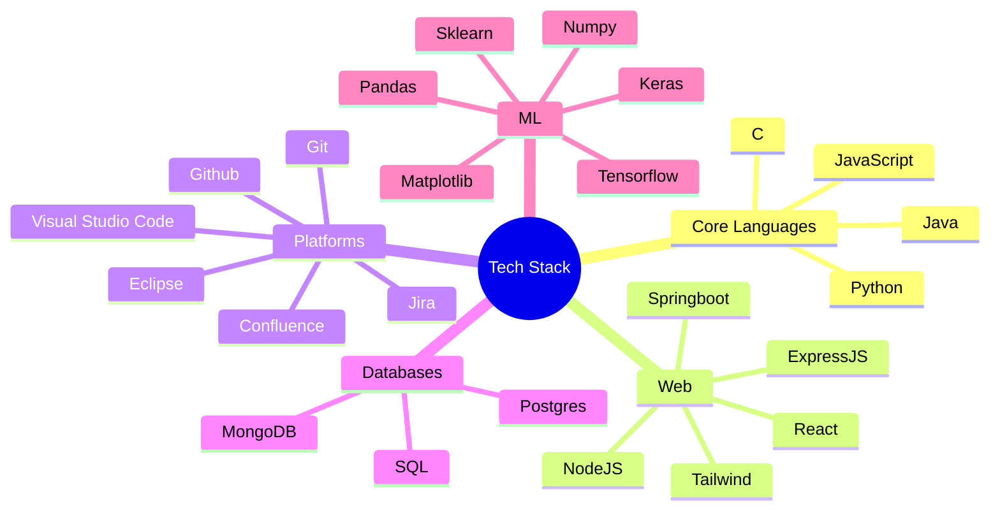

# 💫 About Me:
Hi there! 👋 I'm Sudarshan Nagulapalli, a Computer Science undergrad at Chaitanya Bharathi Institute of Technology(CBIT), specializing in AI and ML. 🏓 National-Level TT Player 💻 Building cool stuff

**Jiraiya, the Toad Sage**   
**"忍びの世界では、どのように生きるかではなく、死んでどのように生きるかです"**  
*In the shinobi world, it's not how you live, it's how you die.*

## 🌐 Socials:
  

## 🏆 GitHub Trophies

# 💻 Tech Stack:
                          

# 📊 GitHub Stats:
 

<!-- Proudly created with GPRM ( https://gprm.itsvg.in ) -->
##  Connect With Me

  
  

